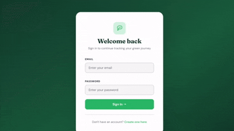

# GreenRoute 🌱

A full-stack web application for tracking personal journeys and estimating their carbon footprint. Built as a coursework project for the **Applied Software Engineering** module of a Software Engineering undergraduate degree.

## Overview

GreenRoute lets users log individual journeys (mode of transport, distance, date) and automatically calculates the associated CO₂ emissions. Admins have access to a dashboard for managing users, journeys, and transport modes across the platform.

## Demo



## Features

- **User authentication** — registration and login with session-based auth
- **Role-based access control** — separate flows and permissions for regular users vs. admins
- **Journey tracking** — create, view, and manage journeys with automatic CO₂ calculation based on transport mode and distance
- **Admin dashboard** — manage users, journeys, and transport modes from a dedicated admin interface
- **Server-rendered views** — built with EJS templating and a custom CSS design system

## Tech Stack

| Layer | Technology |
|---|---|
| Runtime | Node.js |
| Framework | Express.js |
| Database | MongoDB (via Mongoose) |
| Templating | EJS |
| Auth | express-session, bcrypt/bcryptjs |
| Testing | Jest, Supertest |
| Dev tools | Nodemon, dotenv |

## Project Structure

```
greenroute/
├── app.js                     # Application entry point
├── config/
│   └── db.js                  # MongoDB connection setup
├── controllers/
│   ├── api/                   # JSON API controllers (auth, journeys, modes, users)
│   └── pages/                 # Server-rendered page controllers (admin, auth, journeys)
├── middleware/
│   └── auth.js                # Authentication / role-checking middleware
├── models/
│   ├── Journey.js
│   ├── TransportMode.js
│   └── User.js
├── routes/
│   ├── api/                   # REST API routes
│   └── pages/                 # Page routes (admin, auth, home, journeys)
├── views/
│   ├── admin/                 # Admin dashboard views
│   ├── auth/                  # Login / register views
│   ├── journeys/               # Journey list, create, and detail views
│   ├── errors/                 # Error pages (e.g. 403)
│   └── partials/               # Shared layout partials (navbar, head, footer)
├── public/
│   └── css/style.css          # Design system / styling
├── tests/                     # Jest test suites
└── create-admin.js            # Script to seed an initial admin user
```

## Getting Started

### Prerequisites

- Node.js (v18+ recommended)
- A MongoDB instance (local or [MongoDB Atlas](https://www.mongodb.com/atlas))

### Installation

```bash
git clone https://github.com/sahradordete/greenroute.git
cd greenroute
npm install
```

### Environment Variables

Create a `.env` file in the project root:

```
MONGODB_URI=your_mongodb_connection_string
SESSION_SECRET=your_session_secret
PORT=3000
```

### Running the app

```bash
# Development (with auto-reload)
npm run dev

# Production
npm start
```

The app will be available at `http://localhost:3000`.

### Seeding an admin user

```bash
node create-admin.js
```

### Running tests

```bash
npm test
```

## Deployment

This project is deployed as a single web service (server-rendered, session-based) rather than split across separate frontend/backend hosts. It is deployed on [Render](https://render.com), with environment variables configured directly in the Render dashboard and MongoDB Atlas network access opened to allow the deployed service to connect.

## Author

Sahra Dordete — Software Engineering undergraduate.
Developed for the **Applied Software Engineering** module.

## License

ISC
